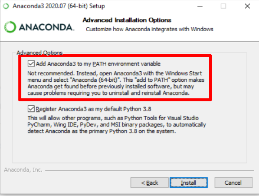

# Informações importantes

-----

Antes de tudo, **te enviamos um e-mail**. Neste e-mail te enviamos os links de convite para o servidor do **Discord** e para sala de aula no **Google Classroom**.  Caso necessário, os links de **todas as plataformas digitais podem ser acessadas no menu superior.**

**Onde:** No Google **Meet** (Ver o menu superior)

**Datas**: de 11/09 à 18/12 (**Toda sexta**)

**Horário**:  

- **Brasília**: Das 16hs às 20hs  
- **Local (Acre)**: Das 14hs às 18hs

**Contato**: cursopython.ufac@gmail.com

# Plataformas digitais

----
### Anaconda

Anaconda é a distribuição que usaremos para rodar os nossos códigos Python em Notebooks. Link para download:

> [https://www.anaconda.com/products/individual](https://www.anaconda.com/products/individual)

A instalação é simples. Basta clicar Next toda vida, porém tem uma ressalva:

> Caso necessite de rodar o Python no terminal do Windows pode clicar na opção: 

### **Discord**

O **Discord** é tipo um **Whatsapp**, só que com muito mais recursos. Será nosso canal de comunicação entre você e os tutores. Lá você poderão **conversar** e **tirar dúvidas** e receber **informações relativas ao curso**. O link para download pode ser encontrado logo abaixo:  

> [https://discord.com/download](https://discord.com/download)  

É recomendado a utilização da versão Desktop do **Discord**. 

**Depois de baixado o Discord, clique no menu superior para acessar o [convite](https://discord.gg/vdCWJu).**

### **Google Classroom**

O **Google Classroom** é a plataforma de ensino  aonde você enviará as suas atividades. Você pode acessá-la clicando no ícone **Entregar atividade**.  Lembrando que a presença nas lives não serão obrigatórias, entretanto nós recomendamos a presença sempre que possível. As **atividades têm caráter obrigatório** e devem ser entregues via Google Classroom/Sala de Aula.  

### **Google Meet**

O **Google Meet** é a plataforma de *streamming* (**lives**) aonde aconterão os encontros semanais. O **link** da live será enviado **uma hora antes** pelos canais de comunicação do curso. Além disso, durante as aulas, **você poderá acessar a live (Google Meet)  no menu superior de plataformas digitais**, localizado no topo do site.

# Conteúdo do curso
----
### **Capítulo 1:** Primeiros passos
> Nesta capítulo o aluno aprenderá à:
> **FAZER DESCRIÇÃO**
> Instalar configurar do Anaconda para o uso do Jupyter Lab com o Python.
> Apresentação do ambiente de desenvolvimento Jupyter Lab.
> Criação de um Notebook e execução de um código Python em um Notebook e no terminal. 

