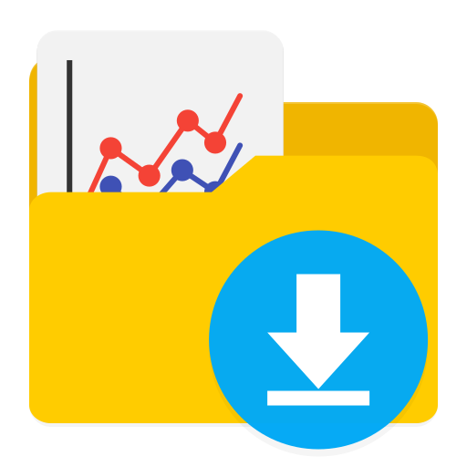

# Primeiros passos
----
Aqui tem um texto indicando os primeiros passos do cursos  

  

# Conteúdo do curso
----
### **Aula 1:** Primeiros passos
> Nesta aula o aluno aprenderá à:
> Instalar configurar do Anaconda para o uso do Jupyter Lab com o Python.
> Apresentação do ambiente de desenvolvimento Jupyter Lab.
> Criação de um Notebook e execução de um código Python em um Notebook e no terminal. 

<ul class="atividade">
    <li>
        
        Roteiro
    </li>
    <li>
        
        Material auxiliar
    </li>
    <!--<li>
        
        Vídeo
    </li>-->
    <li>
        
        Entregar atividade
    </li>
</ul>