<center><div style="font-size:32px;display:inline-block;font-weight:bold;margin-block-end: 0.43em;" class="aula-title">Capítulo 1: Primeiros passos</div></center>

----

# Introdução

**Mas afinal o que é o Jupyter Notebook?**

O Notebook é um conceito revolucionário, pois permite unir código e texto, assim cada funcionalidade pode ser explicada detalhadamente. Você também pode criar funcionalidades dinâmicas, como gráficos, análise de dados ou outros cálculos, em tempo real.

Utilizando o Jupyter é possível escrever o trabalho da faculdade, relatórios de estágio, fazer anotações para consolidar o aprendizado, desenvolver os estágios iniciais da sua pesquisa científica, ou criar este material didático que você esta lendo neste momento. Veja abaixo algumas imagens do que o Jupyter é capaz. 


> Imagens tiradas do site oficial do Jupyter Notebook.

`Você será capaz de fazer algo parecido com isso em alguns capítulos!`

Por padrão, os códigos do Jupyter Notebook são feitos na linguagem de programação Python. É possível trabalhar com outras linguagens, porém não será abordado neste curso. O texto é feito através da linguagem `Markdown`, uma linguagem de marcação (ou criação?) tão simples que é possível dominar os conceitos básicos em menos de 10 minutos. Embora simples, o `Markdown` é uma linguagem poderosa! Por exemplo, partes do site de apoio do curso foi feito utilizando a linguagem Markdown, assim como o roteiro deste capítulo.

> **Curiosidade:**  O nome Jupyter vem de [**Ju**]lia, [**Pyt**]hon [**e R**], as principais linguagens de programação utilizadas pelos cientistas de dados. É possível utilizar o Jupyter com essas três linguagens, e com outras, como C++.

**E o JupyterLab?**

O `JupyterLab` é uma evolução do antigo (Porém, ainda bastante usado) ambiente de desenvolvimento `Jupyter Notebook`. Este ambiente de desenvolvimento utiliza tecnologias web mais modernas que o seu velho companheiro, possui alta performance e possui um interface mais flexível e poderosa.

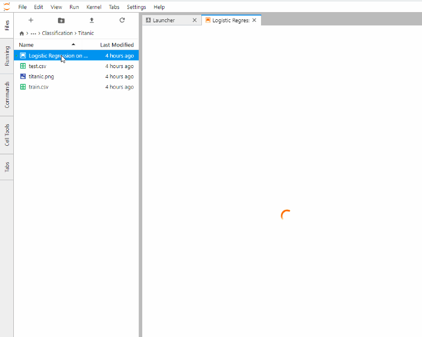

> Imagem retirada do site: https://towardsdatascience.com/.

### Parte 1: Instalação do Anaconda

Existem várias maneiras de instalar um ambiente de desenvolvimento de Python na sua máquina. Uma das maneiras mais práticas é através do **Anaconda**. Primeiramente acesse o site:

https://www.anaconda.com/products/individual

Procure por **Download** e baixe o instalador:  
> Certifique-se que está baixando o `anaconda3`, a versão do Anaconda com o Python3.  


Depois siga os passos como a instalação de qualquer outro programa do windows. Contudo, atente-se para selecionar `Add Anaconda3 to my PATH environmental variable`, como mostrado na figura abaixo: 


Após a instalação ser concluida, vá no menu iniciar e execute o **Anaconda Navigator (anaconda3)**. Este aplicativo é um hub que nos fornece atalhos para diversos outros aplicativos. 

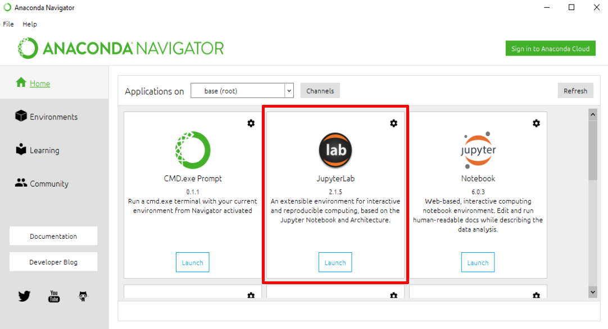

Clique em **Launch**, o programa irá iniciar o servidor e abrir a interface do Jupyter Notebook no navegador.

> Caso tenham dificuldades em abrir a interface do Jupyter no Navegador, recomendamos que utilize o navegador Google Chrome.

**Instalação no Linux**

A instalação no Linux pode ser feita seguindo o passo a passo disponível no link abaixo:

> [https://docs.anaconda.com/anaconda/install/linux/](https://docs.anaconda.com/anaconda/install/linux/)

Após a instalação você pode executar o Anaconda Navigator utilizando o comando `anaconda-navigator` no terminal. Caso queira criar um atalho no menu da sua distribuição, você pode dá uma olhada [aqui](https://dannyda.com/2020/03/21/how-to-create-shortcut-icon-for-anaconda-anaconda3-navigator-launch-anaconda-navigator-in-linux-debian-ubuntu-kali-linux).

Se ainda assim você estiver dúvidas em relação à instalação do Anaconda você pode ajuda aos nossos monitores no nosso servidor do Discord.

### Parte 2: Instalação do Discord

**Passo 1: Instalação e criando conta**

Baixe o Discord em [https://discord.com/download](https://discord.com/download) e instale-o.


Na tela de login, caso ainda não possua uma conta, clique em "Registre-se".


Preencha seus dados e crie uma nova conta. Após o processo, será necessário verificar sua conta pelo seu e-mail. Agora, já estará apto a logar no Discord. 

**Passo 2: Entrar em um servidor Discord**

Agora que já estamos logados, está na hora de entrar em um servidor Discord, no nosso caso, no servidor do `Curso de Python UFAC`.

Procure na sua tela inicial o botão indicado por um `+`, como mostrado na seguinte imagem.


Clique no botão "Entrar em um servidor". 

**Passo 3: Interagindo no servidor**

Agora que já estamos no servidor, podemos usufruir dos seus canais de Voz e de Texto. 


Os canais sinalizados com um `#`(seta em azul) são canais onde os membros podem interagir por meio de **texto**, e os canais sinalizados com um pequeno auto-falante (seta em amarelo) são canais onde pode-se interagir por **voz**.

No canto inferior esquerdo, são encontrados os botões de bloquear o microfone, bloquear o som, compartilhar tela, ligar vídeo e desconectar.


Em nosso Discord, você pode chamar a atenção de algum monitor em qualquer dos canais de texto utilizando o comando `!ajuda`.


Também pode utilizar o comando `!informacoes`, para imprimir na tela algumas informações sobre o curso.


Caso o Discord não reconheça seu microfone, tente ir em configurações (no canto inferior direito), e selecionar a aba "Voz e vídeo" para mudar os dispositivos de entrada e saída.


Para qualquer dúvida em relação ao Discord, procurar o monitor **Gustavo**.

# Prática 1: A interface do Jupyter

Ao abrir o programa pela primeira vez você irá encontrar uma interface parecida com essa:

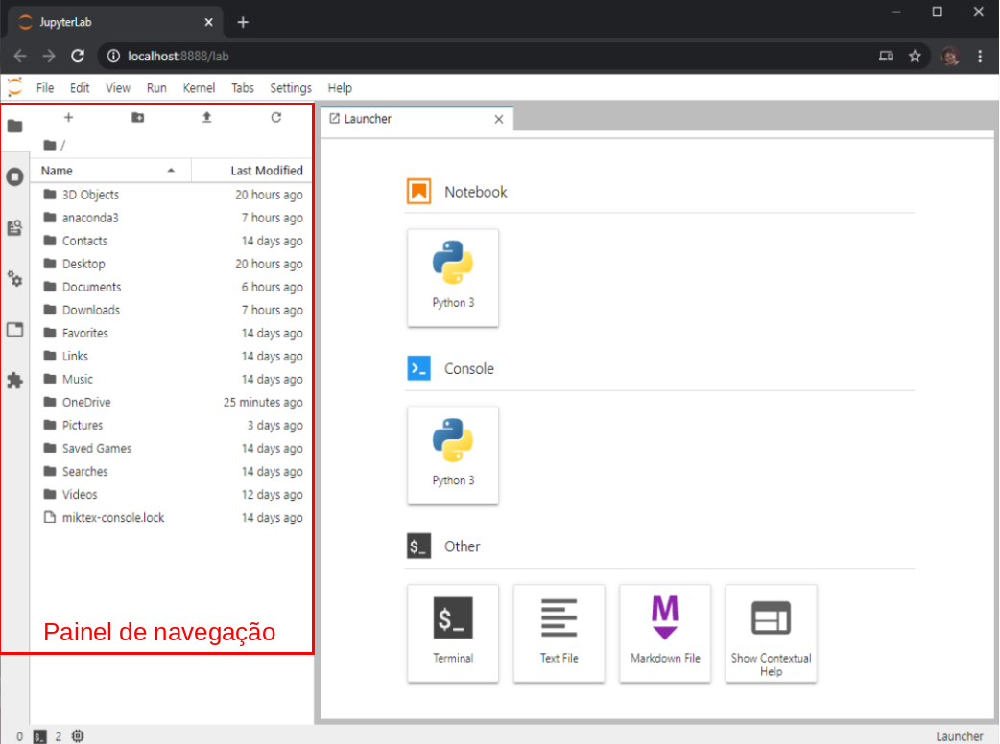

Ao clicar no ícone de pasta no lado esquerdo. Você poderá abrir ou fechar o painel de navagação.  Assim, abra o painel e selecione uma pasta para criar seus projetos. Caso necessário é possível clicar uma pasta dentro do próprio painel de navegação. Iremos criar a pasta `Documents/Meus_notebooks`. Dentro desta pasta iremos criar uma outra pasta chamada `Aula_1`.

Depois de selecionar a pasta de trabalho, na aba **Launcher**. Nesta aba você poderiar criar novas instâncias de `Notebook`, `Console`, arquivos `Markdown`, dentre outros. Onde tem `Notebook` selecione `Python 3`. Irá criar um novo arquivo na sua pasta de trabalho chamado `Untitled.ipynb`. Você pode renomeá-lo clicando no botão direito e em seguida em `Rename`.  Coloque o nome do arquivo como: `Aula_1.ipynb`.

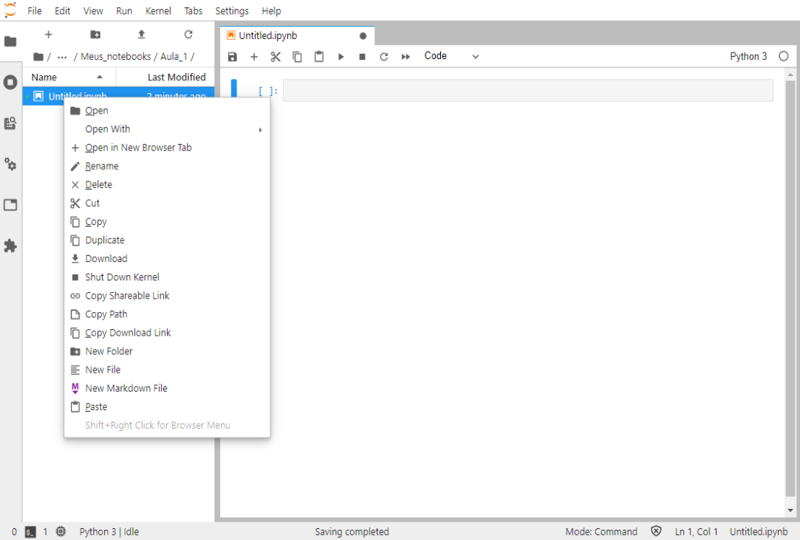

**Trocando para o tema escuro**

Caso não se sinta confortável com o tema claro que vem por padrão no JupyterLab é possível trocar clicando no menu superior em `Settings/JupyterLab Theme/JupyterLab Dark`. Caso queira mudar o tema da barra de rolagem deixe a opção `Theme Scrollbars` ativa. 

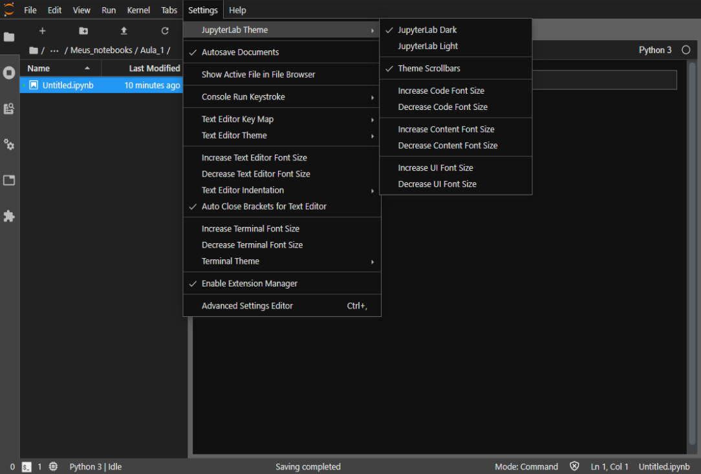

**Menu de ajuda**

Dentro do próprio Notebook é possível acessar a documentação oficial de muitas das "tecnologias" utilizada na confecção dos Notebooks. Isto é bem prático, pois evita aquela pesquisa no Google que nem sempre trás informações relevantes. Por exemplo, clique em `Help>Markdown Reference` e irá abrir uma aba com as principais referências da linguagem. E ainda, há um pequeno tutorial que você pode fazer mais tarde, em casa.

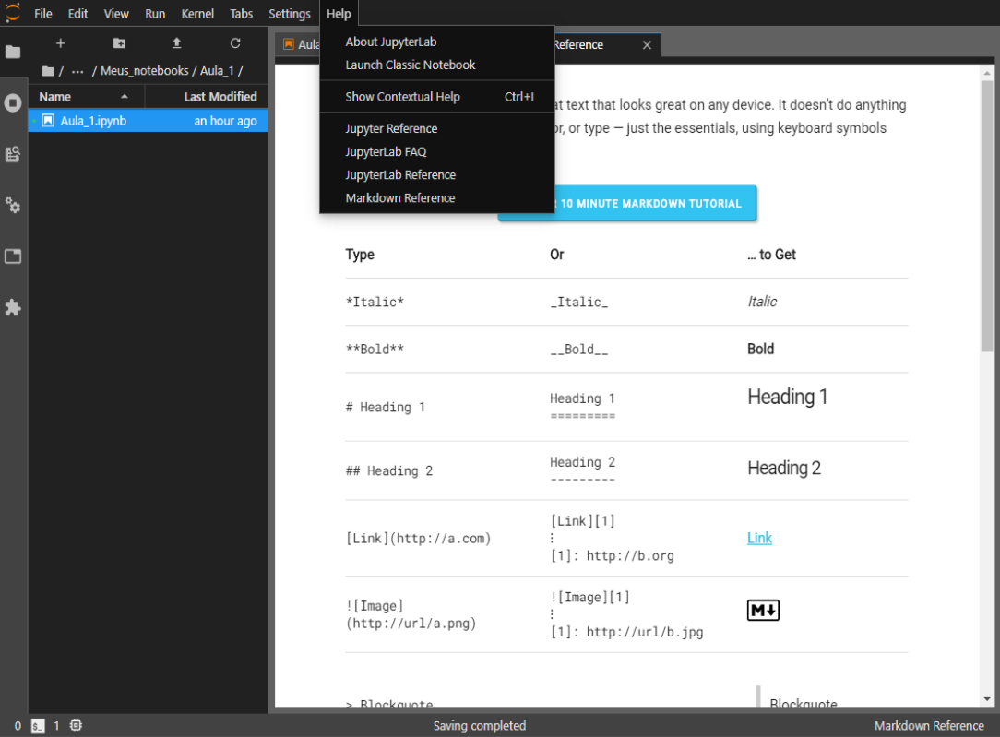

Lembre-se de **sempre visitar este menu** antes de fazer aquela pesquisa no google.

### Parte 1: Criação e Execução de Células

Um Notebook é formado por uma ou mais células. Uma célula é um espaço aonde é possível escrever um trecho de código (Python) ou texto (código Markdown).  Algumas ações relacionadas ao notebook e às células podem ser executadas no painel superior da aba. A figura abaixo mostra alguns atalhos do painel superior.

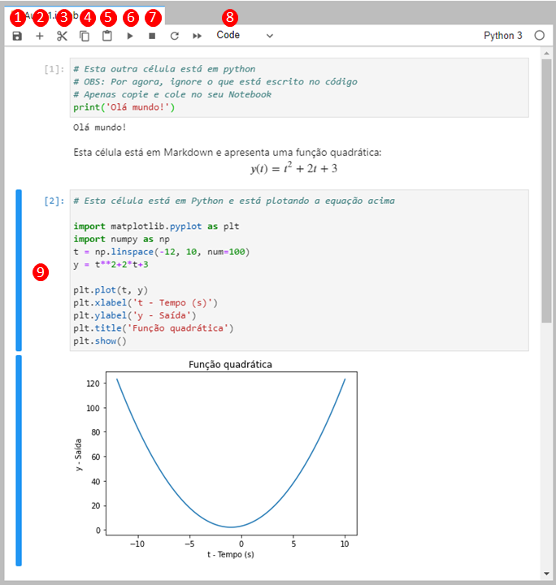

> Figura 1.1: Exemplos de células no Jupyter.

| **No.** | **Descrição**                                                |
| :-----: | ------------------------------------------------------------ |
|    1    | Salvar Notebook                                              |
|    2    | Adicionar uma nova célula abaixo                             |
|    3    | Recortar uma célula                                          |
|    4    | Copiar uma célula                                            |
|    5    | Colar uma célula                                             |
|    6    | Executar (Compilar) uma célula e ir para a próxima célula    |
|    7    | Parar a execução do código (Muito importante quando seu código trava!) |
|    8    | Mudar do modo código para o modo texto (Markdown)            |
|    9    | Area de seleção de células                                   |

> Tabela 1.1: Descrição de cada botão ou região da Figura 1.1.


**Agora vamos para a prática!**

Vamos à um exemplo. Considere os códigos abaixo, **não se preocupe em entendê-los agora**. Considere os códigos abaixo:

**Célula 1:** Modo texto - Python

```
# Atividade 1

```

**Célula 2:** Modo código - Python

```python
# Está célula está em Python.
# Iremos escrever nossa primeira célula
print("Olá mundo")
```

**Célula 3:** Modo texto - Markdown

```markdown
Esta célula está em Markdown e apresenta uma função quadrática:
$$y(t)=t^2+2t+3$$
```

**Célula 4:** Modo código - Python

```python
# Esta célula está em Python e está plotando a equação acima

import matplotlib.pyplot as plt
import numpy as np
t = np.linspace(-12, 10, num=100)
y = t**2+2*t+3 
plt.plot(t, y) 
plt.xlabel('t - Tempo (s)') 
plt.ylabel('y - Saída') 
plt.title('Função quadrática') 
plt.show() 
```

**Copie e cole-os no seu Notebook de acordo com a linguagem indicada e depois execute-os.**

> **Dicas**: 
>
> - Para executar a célula e avançar para a próxima célula pressione no botão `▶` (Número 6 na Figura 1.1).
> - Se necessário, pode-se adicionar uma célula abaixo clicando no `+`, representado pelo `número 2` na Figura 1.1.
> - Se necessário é possível mover as células na região `9` da Figura 1.1.

### Parte 2: Copiar e colar células

Crie um novo Notebook, nomeie como `Aula_1aux`, recorte a célula 1 do seu primeiro Notebook e cole no Notebook `Aula_1aux`.

### Parte 3: Reiniciando o Kernel

Toda vez que uma célula de código é executada, os valores das variáveis finais das variáveis são salvas na memória. Desta forma, ao executar uma célula nem sempre o resultado vai ser o mesmo. Para deixar mais claro este conceito considere as três células abaixo:

**Célula 1:** Bloco de atribuição da variável `x`:

```python
# Atribua o valor 0 à variável 'x'
x=0
```

**Célula 2:** Incremente a variável `x` em 1

```python
# Incremente esta variável em 1
x=x+1
```

**Célula 3:** Imprima o valor da variável `x`

```python
# Mostre o valor de 'x'
x
```

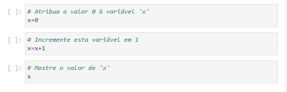

Para ficar claro, copie as três células e faça a seguinte sequência de execução:

​	Célula 1 $\rightarrow$ Célula 2 $\rightarrow$ Célula 2 $\rightarrow$ Célula 2 $\rightarrow$ Célula 3 $\rightarrow$  Célula 2 $\rightarrow$ Célula 3 $\rightarrow$  Célula 1 $\rightarrow$ Célula 3 

> **Dicas:** 
>
> - Selecione a célula e utilize o atalho `Ctrl+B` para executar a célula pelo teclado.
> - Use as teclas &uarr; e &darr; para movimentar entre as células.

Observe que toda vez que uma célula é executada há um aumento da numeração do lado direito da célula. Esta numeração indica a ordem que as células foram executada. 

Muitas vezes queremos limpar a memória. Para isso o podemos recorrer ao menu do `Kernel` , o servidor que roda o código em Python. Neste menu temos opção `Restart Kernel...` que apaga todas as variáveis da memória. Além disso existe outras opções como:

|                Opção                 | Função                                                |
| :----------------------------------: | ----------------------------------------------------- |
|          Restart Kernel...           | Reinicia o kernel (Apaga todas as variáveis)          |
| Restart Kernel and Clean All Outputs | Reinicia o kernel e limpa todas as saídas das células |
|   Restart Kernel and Run All Cells   | Reinicia o kernel e roda todo o Notebook              |

> Tabela 1.2: Algumas funções do menu Kernel


Finalmente, reinicie o servidor e tente a célula 2. Observe que aconteceu um erro, pois a variável x que deveria ser inicializada na célula 1 não está mais na memória, pois o Kernel foi reiniciado.

### Parte 4: Atalhos

O Jupyter permite o uso de vários atalhos que podem facilitar a nossa vida. No menu `Run` podemos ver alguns atalhos:

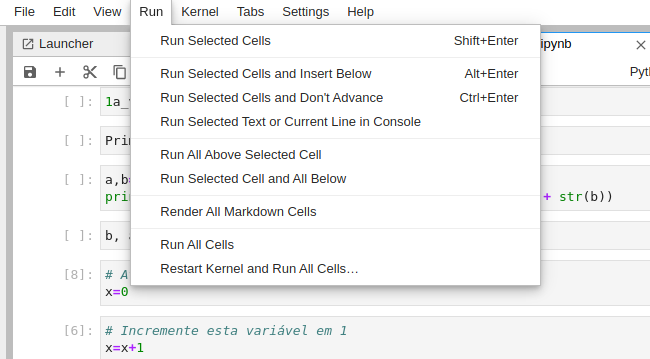

|   Atalho    | Função                                       |
| :---------: | -------------------------------------------- |
| Shift+Enter | Rode a célula e avance para a próxima célula |
| Ctrl+Enter  | Rode a célula, mas não avance                |
|  Alt+Enter  | Rode a célula e insira outra célula abaixo   |

**Modo de edição e modo de comando:**

Existem alguns atalhos que só podem ser acessados no modo de comando. De forma resumida:
> No modo de edição você pode editar as células e no modo de comando você pode utilizar alguns atalhos relacionado às células.

É possível ver se a célula está no modo de comando ou de edição na barra de status:

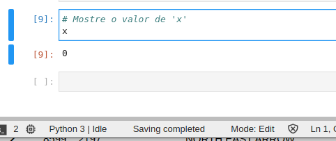

> Figura 1.2: Esta célula está no modo de de edição.

Para acessar o **modo de comando** clique na região esquerda fora da célula ou simplesmente aperte o botão `Esc`, e para acessar o **modo de edição** clique dentro da célula ou aperte `Enter`. No modo de comando é possível utilizar os seguintes atalhos:

|            Atalho             | Função                             |
| :---------------------------: | ---------------------------------- |
|      D, D (D duas vezes)      | Apaga a célula                     |
|     Setas &uarr; e &darr;     | Navegue entre as células           |
|               A               | Adiciona uma célula acima (Above)  |
|               B               | Adiciona uma célula abaixo (Below) |
| Shift + Setas &uarr; e &darr; | Seleciona mais de uma célula       |

Além disso, é possível selecionar várias células pressionando `Shift` e clicando com o mouse.

# Prática 2: Introdução ao Markdown

### Parte 1: A linguagem Markdown

Primeiramente iremos apenas brincar de copiar e colar.  Abra uma nova instância do seu notebook e compare-o lado à lado, sempre com uma instância compilada (Executada) e outra não.

**Célula 1:** Texto genérico

Nesta célula apenas copie e cole e veja o que acontece.

```
## Atividade 2
----

# Capítulo 1 - Primeiros passos
#### Data da aula: 11 de setembro de 2020.

### Contato.
**Nome**: Beatriz Mestra em Markdown
**E-mail**: beatriz.mestra@cursopythonufac.github.io
**Telefone**: (68) 9 9999-9999

# 1. Elementos textuais em Markdown

### Primeiro vamos ver como deixar nosso texto em negrito, itálico ou tachado.
### Exemplo:
Esta palavra está em **negrito**. Engraçado, pois __esta também__.

Legal para vocês, mas eu estou em *itálico*, assim como _esta_.

~~Eu sou apenas um tachado mesmo.~~ 

### É importante saber, principalmente na hora de fazer o seu cabeçalho, que existe *hierarquias* de texto. Se você já é familiarizado com HTML, saberá do que estamos falando.
### Exemplo:
# Texto Nível 1

## Texto Nível 2

## Texto Nível 3

### Texto Nível 4

#### Texto Nível 5

##### Texto Nível 6

### ------------------------------------------------

### Temos como inserir código em um arquivo .md (markdown).
### Para fazer isto, basta: \` codigo aqui `

`print("codigo inline")`

### Ou \``` codigo aqui ```:

​```python
myname = "Mestre"
myage = 200

if myage >= 18:
    print("Pode ser preso.")
else:
    print("Não pode ser preso.")
```
Conseguiu encontrar alguns padrões?

**Célula 2:** Código

Fizemos acima um código genérico. Se quisermos especificar a linguagem de programação devemos usar: \``` python \```. 

Crie uma nova célula e coloque o seguinte código abaixo entre \```.

```python
ling = "python"

if ling != "python":
    break
else:
    print("Melhor linguagem.")
```

**Célula 3:** Citações

Podemos escrever citações. Veja como:

```markdown
> Agir, eis a inteligência verdadeira. 
> Serei o que quiser. Mas tenho que querer o que for. 
> O êxito está em ter êxito, e não em ter condições de êxito. 
> Condições de palácio tem qualquer terra larga, 
> mas onde estará o palácio se não o fizerem ali?
```
Resulta em:

---

>Agir, eis a inteligência verdadeira. 
>Serei o que quiser. Mas tenho que querer o que for. 
>O êxito está em ter êxito, e não em ter condições de êxito. 
>Condições de palácio tem qualquer terra larga, 
>mas onde estará o palácio se não o fizerem ali?

---

Agora pense num poema bem bonito e escreva no formato de citação.

**Células 4 e 5:** Listas

Para trabalhar com lista, podemos fazer da seguinte forma:

```markdown
**Lista não ordenada:**
- item 1
    - item 1.1
    - item 1.2
- item 2
    - item 2.1
    - item 2.2
- item 3
    - item 3.1
    - item 3.2
```
Resulta em:

----

**Lista não ordenada:**
- item 1
    - item 1.1
    - item 1.2
- item 2
    - item 2.1
    - item 2.2
- item 3
    - item 3.1
    - item 3.2

----

Veja como faz uma lista ordenada:

```markdown
**Lista ordenada:**
1. Elemento 1
2. Elemento 2
3. Elemento 3
```
Resulta em:

----
**Lista ordenada:**

1. Elemento 1
2. Elemento 2
3. Elemento 3

----

Agora vamos para praticar criando nossas próprias listas.
> **Exemplos:**
>
> > **Lista ordenada**: Lista das suas músicas favoritas, seus filmes favoritos, seus pokemons favoritos, etc.  
>
> > **Lista não ordenada**: Afazeres domésticos, compras de supermercado, coisas que eu quero aprender em Python, etc.

** Lista ordenada não ordenada**:

1. Elemento 1
2. Elemento 2
3. Elemento 3

### Parte 2: Criando o cabeçalho

Você se lembra do menu de ajuda do Jupyter? Entre lá e procure por `Markdown Reference`.


Dentro do seu Notebook crie uma célula no topo da atividade.

> **Dica:** Clique na primeira célula, entre no modo de comando e aperte `A` de Above.

Agora crie o seu cabeçalho.

O meu ficou assim:

```html
<center><h1>Capítulo 1: Primeiros passos</h1></center>

<center><div style="font-size:24px;display:inline-block;">11 de setembro de 2020</div></center>

__Nome do(a) aluno(a)__: Beatriz Mestra em Markdown  
__Matrícula__: 9999999999999  
__Telefone__: (68) 9 9999-9999  
__E-mail__: beanascigom@gmail.com  
```

Resulta em:

----

<center><div style="font-size:28px;display:inline-block;font-weight: bold;margin-block-end: 0.43em;">Capítulo 1: Primeiros passos</div></center>

<center><div style="font-size:24px;display:inline-block;margin-block-end: 0.83em;">11 de setembro de 2020</div></center>

__Nome do(a) aluno(a)__: Beatriz Mestra em Markdown  
__Matrícula__: 9999999999999  
__Telefone__: (68) 9 9999-9999  
__E-mail__: beatriz.mestra@cursopythonufac.github.io  

-----

>**Dicas:** 
>
>> Se você conhece, você pode usar em HTML e CSS para deixar o seu texto ainda mais rico. Mais informações [aqui](https://www.w3schools.com/html/html_basic.asp).
>
>> Evite usar muitos # no seu cabeçalho pois isso pode atrapalhar na geração de índice ao exportar seu Notebook para pdf, LaTeX ou HTML.

**Ah, a partir de agora não se esqueça de criar os títulos das práticas e de suas respectivas partes 😉**

# Prática 3: Introdução ao Python

### Parte 1: Comentários

Digite em seu notebook o seguinte código:

```python
# aqui vamos refazer o cabeçalho utilizando variáveis
# aliás, você sabe quem sou eu?

'''
Eu sou um comentário em Python.
No meu caso, sou de várias linhas.
Mas o meu colega ali em cima, é de apenas uma.
Sacou? :D
'''
# Agora segue meu cabeçalho utilizando um comentário:

'''
-------Capítulo 1 - Primeiros passos----------
> Data: 11 de setembro de 2020.
> Telefone: (68) 9 9999-9999  
> E-mail: beatriz.mestra@cursopythonufac.github.io
'''
```

Execute o código. Você pode ir até "Run" ou use o atalho `Ctrl + Enter`.

Agora use sua imaginação e crie o seu próprio cabeçalho em utilizando comentários.

> **Dica:** Use o comentário multi-linha para criar o seu cabeçalho. 

### Parte 2: Operadores

Em Python, podemos escrever expressões matemáticas como em qualquer outra calculadora (Como o MatLab, por exemplo). Expressões consistem de valores, como `2` e operadores, como o `+`.

Escreveremos `2+2` na célula abaixo, e vemos que a expressão irá assumir o valor final de `4`. 

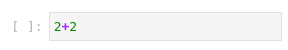

Podemos usar diversos operadores para computar diversas expressões como quisermos, como listado na tabela abaixo.

| Operador |    Operação     | Exemplo | Resulta em |
| :------: | :-------------: | :-----: | :--------: |
|    **    |    Expoente     | 2 ** 3  |     8      |
|    %     |      Resto      | 22 % 8  |     6      |
|    //    | Divisão inteira | 22 // 8 |     2      |
|    /     |     Divisão     | 22 / 8  |    2.75    |
|    *     |  Multiplicação  |  3 * 5  |     15     |
|    -     |    Subtração    |  5 - 2  |     3      |
|    +     |     Adição      |  2 + 2  |     4      |

A ordem dos operadores da matemática do Python é similar à usada na matemática comum, ou seja, primeiro as potências (`**`), depois multiplicações e divisões (`*` e `/`) e por fim as somas e subtrações (`+` e `-`), da esquerda para a direita. Podemos também usar parênteses. Agora, vamos tentar calcular o valor de algumas operações para exercitar o que foi aprendido. A seguir execute as seguintes operações:

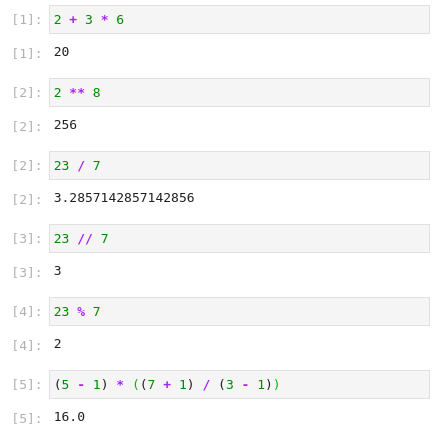

Agora tente calcular as seguintes operações:

- $\frac{8}{2}\times (2+2)$
- $(2+3)\times 3^3$
- $7+7\div 7 + 7 \times 7 -7$
- $\sqrt{9^2-4\times3}$

> **Dica:** Use $x^{0,5}$ para calcular $\sqrt{x}$.

O python não reconhece expressões que não fazem sentido, como a expressão abaixo. Tente rodar a seguinte célula. Por exemplo, tente rodar o código abaixo:

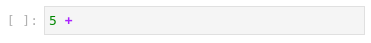

### Parte 3: Tipos de dados

Existem diversos tipos de dados em Python que se comportam de diferente formas em expressões, os três tipos mais básicos são:

|       Tipo de dado        |                      Exemplo                      |
| :-----------------------: | :-----------------------------------------------: |
|          Inteiro          |             -2, -1, 0, 1, 2, 3, 4, 5              |
| Ponto flutante (Decimais) |      -1.25, -1.0, -0.5, 0.0, 0.5, 1.0, 1.25       |
|          Strings          | 'a', 'aa', 'aaa', 'Hello!', 'curso de python', '' |

Integers (`int`) se refere aos números inteiros, floating-point numbers (`float`) se refere a números com casa decimal e strings são textos.

Note que as strings tem sempre aspas simples em suas extremidades como `'Isso é uma string'`

Note, que você pode somar dois inteiros, como `3+5`, mas não pode somar um inteiro e uma string, como na célula abaixo.

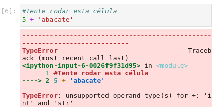

No entanto, podemos utilizar os operadores de `+`e de `*` para concatenar strings, por exemplo.

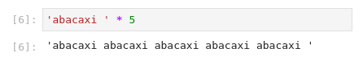

### Parte 4: Variáveis

Em Python, podemos armazenar nossos dados em variáveis. Variáveis funcionam como caixas em que podemos guardar o que quisermos utilizando o operador `=`. Vamos praticar escrevendo os exemplos abaixo:

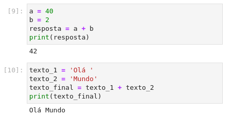

Os nomes de variáveis só podem ser uma palavra, com números e underline `_`. Nomes de variáveis não podem começar com números. Tente os seguintes exemplos abaixo:

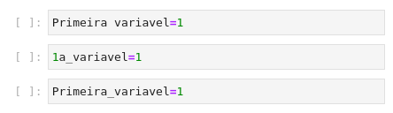

### Parte 5: Entrada & saída

**print()**:

A função `print()` tem o objetivo de imprimir na tela o valor que estiver sendo passado, como você pôde perceber no exemplo anterior. Escreva o código abaixo e execute.

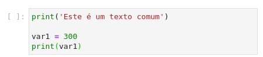

**input()**:

A função `input()` tem o objetivo de pedir ao usuário algum dado para ser manualmente entrado no terminal. Agora siga o exemplo e execute


Note que os dados coletados pela função `input()` são sempre do tipo `string`. Veremos no próximo exemplo como transformar esses dados.

### Parte 6: Transformação de dados

Algumas vezes será necessário converter de um tipo de dado para outro para podemos operar. A função `Input()`, por exemplo, sempre resulta em uma `string`, mas podemos usar outras funções para podermos transformar esse dado em um número. Essas funções são `str()`, `int()` e `float()`. Escreva o código abaixo, execute e veja o que acontece:

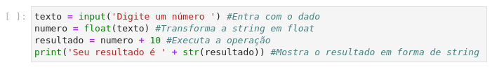

### Parte 7: Atribuição múltipla

No Python é possível atribuir vários valores de variáveis numa mesma expressão. Desta forma, teremos em ambos os lados do operador um conjunto de variáveis e de valores. Para praticar execute o código abaixo:

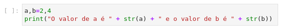

Agora, utilizando a mesma lógica crie um código capaz de atribuir três variáveis $a=6$, $b=7$ e $c=10$.

# Prática 4: Para casa

### Parte 1: Complete a frase

Crie pequeno programa (uma ou mais células) capaz de produzir a seguinte frase:

> "Olá, meu nome é \_\_\_\_\_\_, tenho \_\_\_ anos, e minha idade daqui a 5 anos será \_\_\_."

Tente construir a seguinte frase, utilizando `input()`, `print()` e conversão de dados.

Além disso, utilize o Markdown para desenvolver um pequeno enunciado para o programa.

### Parte 2: Pergunta teórica

Por que a expressão abaixo causa erro? 

```python
print('Eu saí de casa ' + 10 + ' vezes na semana passada')
```

> **Dica:** Responda esta pergunta utilizando o modo texto (Markdown).

### Parte 3: Fórmula de báskara

Crie pequeno programa (uma célula) capaz de resolver qualquer equação de segundo:  
$$
ax^2+bx+c=0
$$
O usuário deve entrar com os parâmetros $a$, $b$ e $c$. Utilize a função input para capturar os dados de entrada.

> **Dica:**
>
> Para resolver a equação de segundo grau você pode utilizar a fórmula de Baskara:  
>  
> $$\{x_1,x_2\}=\frac{-b\pm\sqrt{\Delta}}{2a}$$
>
> $$\Delta=b^2-4ac$$
> 

Está equação retorna duas soluções, $x_1$ e $x_2$. Você deve usar a função `print()` para imprimir o resultado das variáveis $x_1$ e $x_2$ na tela na tela. 

### Parte 4: Trocando valores de duas variáveis

Crie uma pequeno programa capaz de trocar o valor entre duas variáveis sem a necessidade de criar uma terceira variável. 

>  **Dica:** Utilize o conceito de atribuição múltipla para fazer a troca das variáveis. 